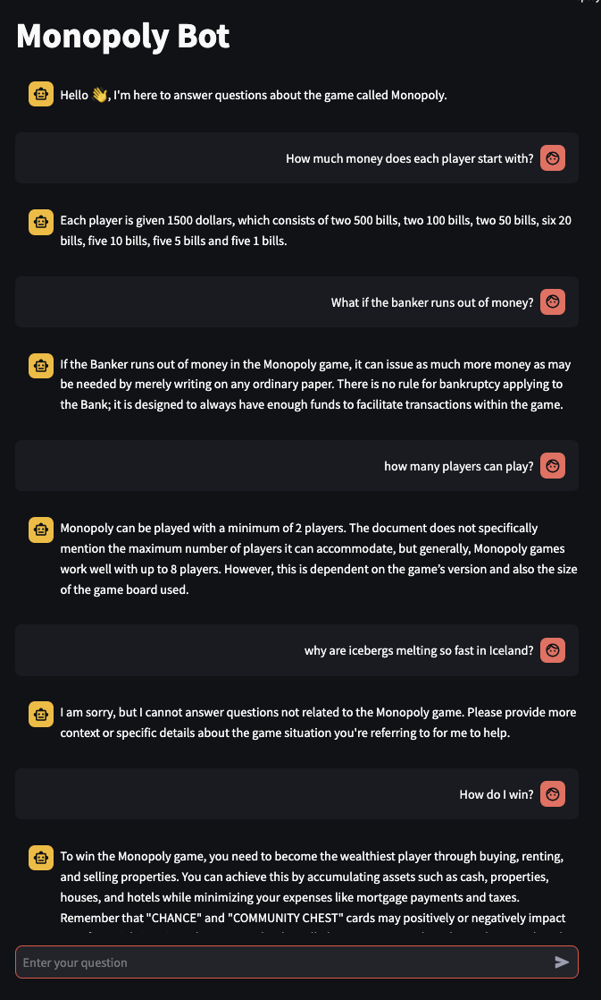

# Monopoly Chatbot
A simple chatbot that answers questions about the game Monopoly
using open source LLM from Ollama.  The models are downloaded
to your desktop and the chatbot can be run without an internet connection.

This is built off of my Simple Streamlit Echo Bot: 
https://github.com/acflippo/Simple_Streamlit_Echo_Bot

The special domain knowledge I'm using is a downloaded play instructions (as this is a RAG implementation for Monopoly), for the game that I've saved as annie_monopoly_vault.txt which
I've removed special characters that would make the embedded Markdown text in _app.py_ not look good. That's a bit of prepocessing going on here outside of this code base.

I performed a bit of Prompt Engineering so the bot would
stay on topic of the game Monopoly.  It's not perfect since LLMs 
are trained from a large corpus of documents and will have knowledge of other topics. I've tried to trick the bot into
discussing other topics but so far so good (see screenshot below 👇).  

Below is a screenshot of the bot input and reply.  I'll
create a video on the interactions perhaps later.

<br />



<br />

## Running the App
For the latest instructions, go https://docs.streamlit.io/get-started/installation

1. In your virtual python environment, run this

```
pip install streamlit
```

2. Install Ollama to your machine by following instructions here: https://ollama.com/

3. Download models you'll need

```
ollama pull mxbai-embed-large
ollama pull dolphin-llama3
```
You can alternatively use larger models such as Ollama3.3 or DeepSeek-r1 but
I've found that those models require a large amount of memory so you might 
want to move to a cloud server instead of your own personal desktop or laptop.

4. Run the app

``` 
streamlit run app.py
```

5. Have Fun!